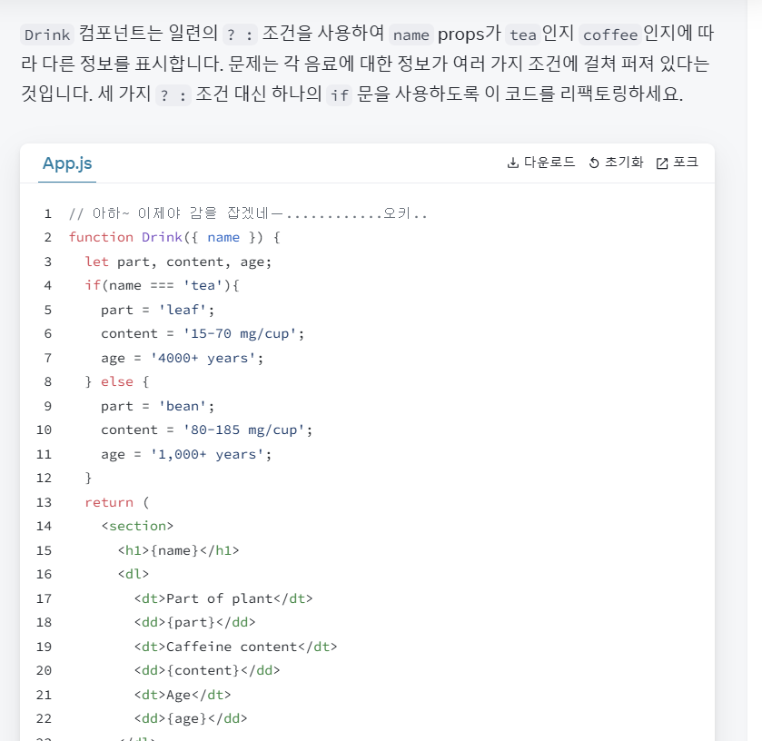

# 🚩 [Week02]: UI 표현하기(조건부 렌더링, 리스트 렌더링, 순수성)

<!-- 제목 예시: [Week1] 예지 - UI 표현하기 (000, 000)
설명: 어떤 내용을 다뤘는지 간단히 작성해주세요
파일은 본인 디렉토리 아래에 정리 (예: /yeji/week1/README.md)
노션 링크 작성도 가능합니다.(기록을 위해 게시 후 md 파일에 링크 작성 부탁드립니다.) -->

# 📖 설명
## 1️⃣조건부 렌더링
리액트는 `if문`, `&&`, `? :` 연산자와 같은 자바스크립트 문법을 사용하여 조건부로 JSX를 렌더링할 수 있다.

#### 🔹조건부로 JSX 반환하기
- 짐을 챙겼는지 안 챙겼는지 표시할 수 있는 여러 개의 Item을 렌더링하는 PackingList 컴포넌트
```
function Item({ name, isPacked }) {
  return <li className="item">{name}</li>;
}

export default function PackingList() {
  return (
    <section>
      <h1>시연이의 준비물 리스트</h1>
      <ul>
        <Item
          isPacked={true}
          name="노트북"
        />
        <Item
          isPacked={true}
          name="노트북 충전기"
        />
        <Item
          isPacked={false}
          name="이어폰"
        />
      </ul>
    </section>
  );
}

```
`isPacked={true}` 인 경우에 챙긴 항목에 체크표시를 추가할 것 ✅
밑에 처럼 조건부로 작성할 수 있다
```
if (isPacked) {
		// true면
		return <li className="item">{name} ✅</li>;
} // false면
return <li className="item">{name}</li>;
```
=> React에서 제어흐름(예:조건문)은 JavaScript로 처리한다.

#### 🔹JSX 조각을 조건부로 포함하거나 제외하는 방법, React 코드에서 흔히 볼 수 있는 조건부 문법
아무것도 렌더링하고 싶지 않을 수 있음! -> 컴포넌트는 반드시 무언가를 반환해야 함 -> null을 반환하면 렌더링하지 않게 될 것
```
if (isPacked) { // true이면 짐 챙긴 거 안 보여주기
	return null;
} // false이면 보여주기 - 챙겨야 한다~
return <li className="item">{name}</li>;
```
‼️ 단, 실제 컴포넌트에서 null을 반환하는 건 흔한 경우는 아니라고 함

- 조건부로 JSX 포함시키기
위에 과정처럼 반환하면, 중복된 코드 줄이 좀 생긴다. `return <li className="item">{name} </li>` 여기서 className을 바꾸고 싶다면?
이 코드가 100줄 있다고 치면 그걸 하나하나 다 바꿔야 함,,
-> 조건부로 약간의 JSX를 포함해서 덜 반복적이게 할 수 있다

✴️ 삼항조건 연산자
위에서 작성했던 반복적인 코드 대신 아래처럼 작성할 수 있음
```
return (
	<li className="item">
		{isPacked ? name + '✅' : name}
	</li>
);
```
‼️삼항조건 연산자는 간단한 조건에는 잘 어울리지만, 적당히 사용하는 게 좋다..!

✴️ 논리 AND 연산자 (&&)
특정 경우에만 무언가를 렌더링하게 할 수 있음
```
return (
	<li className="item">
		{name} {isPacked && '✅'} // isPacked가 true인 경우에만 체크 표시 렌더링!
	</li>
);
```
`&&` 표현식은 왼쪽(조건)이 true 이면 오른쪽의 값을 반환한다. 조건이 false이면 전체 표현식이 false가 되고 아무것도 렌더링하지 않는다..
(`false`를 `null` 또는 `undefined`처럼 JSX 트리의 구멍으로 간주하고 그 자리에 아무것도 렌더링하지 않음)
‼️주의할 것
`&&`의 왼쪽에 숫자를 두지 말 것!

🔨 챌린지 도전하기 중..
- 세 번째 if문으로 고쳐보기에서 JSX 문법이 익숙하지가 않아서 냅다 if문을 써버렸는데 html 부분과 자바스크립트 부분을 혼용하지 않고 명확히 분리해서? 사용해야 한다는 것을 알게 되었다...


---

## 2️⃣리스트 렌더링
데이터에서 유사한 컴포넌트를 여러 개 표시하고 싶을 때 배열 메서드를 사용하여 데이터 배열 조작 가능

#### 🔹JavaScript의 map()을 사용하여 배열을 컴포넌트로 렌더링하는 방법
배열에서 항목 리스트를 생성하는 방법
1. 데이터를 배열로 이동한다
```
const people = [ '아이유: 가수', '김시연: 학생', '유인나: 배우' ];
```
2. 요소를 새로운 JSX 노드 배열인 listItems에 매핑한다
```
const listItems = people.map(person => <li>{person}</li>);
```
3. 래핑된 컴포넌트의 listItems를 반환한다.
```
return <ul>{listItems}</ul>;
```

#### 🔹JavaScript의 filter()를 사용하여 특정 컴포넌트만 렌더링하는 방법
filter() 함수를 사용해서 특정 정보만 선택한 새로운 배열을 생성할 수 있다
```
const people = [{
    id:0,
    name: '아이유',
    job: '가수'
}, {
    id: 1,
    name: '유인나',
    job: '배우'
}, {
    id: 2,
    name: '김시연',
    job: '학생'
}
];
```
여기서 직업이 '가수'인 사람만 표시하고 싶다면
```
const singer = people.filter(person => person.job === '가수');
```
이렇게 하면 가수로만 구성된 새로운 배열을 생성한다.
얘를 또 매핑하면 뿌려줄 수 있겠지...!

❗주의할 점
: 화살표 함수는 암시적으로 `=>` 바로 뒤에 식을 반환하기 때문에 return 문이 필요하지 않다! 하지만 `=>`뒤에 { 중괄호가 오는 경우 return을 명시적으로 작성해야 한다.

#### 🔹React에서 Key가 필요한 때와 이유
위에서 실습한 거 콘솔에 에러가 표시되는 걸 확인할 수 있는데, 각 배열 항목에 고유하게 식별할 수 있는 문자열 또는 숫자를 key로 지정해야 한다.
> map() 호출 내부의 JSX 엘리먼트에는 항상 key가 필요하다.
❗주의할 점
: 즉석에서 key 생성하지 말기, 컴포넌트가 key를 prop으로 받지 않는다는 점 유의하기


---

## 3️⃣순수성
자바스크립트 일부 함수는 순수하다! 순수함수는 오직 연산만을 수행한다.
컴포넌트를 엄격하게 순수함수로 작성하면 코드베이스가 점점 커지더라도 예상 밖의 동작이나 당황케하는 버그를 피할 수 있다.
#### 🔹순수성
순수성의 특징 2가지
- 자신의 일에 집중한다 : 함수가 호출되기 전에 존재했던 어떤 객체나 변수는 변경하지 않는다.
- 같은 입력, 같은 출력 : 같은 입력이 주어졌다면 순수함수는 같은 결과를 반환해야 함.
ex) 수학에서 y=2x라는 함수를 생각해보면, x의 값이 2, 3, 4 .. 일 경우 y는 항상 4, 6, 8..이다. 그날의 시간이나 날씨(?)와 같은 다른 요인에 의해 y의 값이 변하지 않음!

#### 🔹의도하지 않은 결과: 사이드 이펙트 (side effect)
컴포넌트는 렌더링하기 전에 존재했던 객체나 변수들은 변경하지 말고 컴포넌트를 순수하지 않도록하는 JSX만 반환해야 한다.
- 이를 위해 Strict Mode를 사용할 수 있다고 함. 사용하려면 최상단 컴포넌트를 <React.StrictMode>로 감싸면 된다. (개발 중에 각 컴포넌트의 함수를 두 번 호출하는 모드 -> 순수성을 위반하는 컴포넌트를 찾을 수 있다)
- 사이드 이펙트는 보통 이벤트 핸들러에 포함된다. (이벤트 핸들러는 React가 일부 작업을 수행할 때 반응하는 기능 ex. 버튼 클릭) => 이벤트 핸들러는 순수할 필요가 없다.
#### 🔹지역 변형 (Local Mutation)
- 렌더링하는 동안 만든 변수와 객체를 변경하는 것은 문제가 없다는 특성?을 말하는 것 같다.
그러니까 내가 동작을 실행하는 메인 함수에서 불러오는 바깥 함수에서 값의 변화가 일어나면 큰 문제지만, 메인 함수 내부에서의 변화는 큰 문제가 없다는...?? 이해가 잘 안 ..가지만 대충 이런 느낌인 듯......


## 🖥️ [실습] 스크린샷
