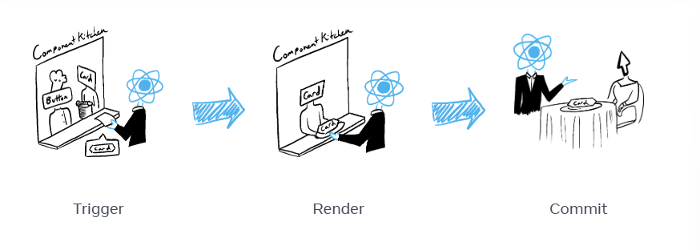

# [3주차] 상호작용 추가하기

화면의 일부 요소는 사용자의 입력에 따라 업데이트된다. React에서는 시간에 따라 변화하는 데이터를 state라고 한다.
state는 어떠한 컴포넌트에든 추가할 수 있고, 필요에 따라 업데이트할 수 있다.

## 1️⃣ 이벤트에 응답하기

React에서는 JSX에 이벤트 핸들러를 추가할 수 있다.

> 이벤트 핸들러: 클릭, 마우스 호버, 폼 인풋 포커스 등 사용자 상호작용에 따라 유발되는 사용자 정의 함수이다.

🔹 버튼 클릭 시 메시지 보여주기

```
export default function Button() {
  function handleClick() {
    alert('나를 눌렀구나!');
  }

  return (
    <button onClick={handleClick}>
      나는야 버튼
    </button>
  );
}
```

`handleClick`함수를 정의하고 `<button>`에 prop 형태로 전달했다. 여기서 handleClick은 **이벤트 핸들러**다.

> 이벤트 핸들러 함수가 갖는 특징
>
> - 주로 컴포넌트 내부에서 정의된다.
> - `handle`로 시작하고 그 뒤에 이벤트명을 붙인 함수명을 가진다.

이벤트 핸들러를 JSX 내에서 인라인으로 정의할 수도 있다.

```
<button onClick={function handleClick() {
  alert('나늘 눌렀구나!');
}}>

// 아니면 화살표 함수로 더 간결하게 정의할 수도 있음
<button onClick={()=>
    alert('나를 눌렀구나!');
}>
```

**_이벤트 핸들러는 짧은 함수들을 정의할 때 편리함!_**

⚠️주의⚠️
이벤트 핸들러로 전달한 함수들은 호출이 아니라 전달되어야 한다.
|함수 전달하기(옳은 예)|함수 호출하기(틀린예)|
|---|---|
|`<button onClick={handleClick}></button>`|`<button onClick={handleClick()}></button>`|

🔹 이벤트 핸들러 내에서 Prop 읽기
이벤트 핸들러는 컴포넌트 내부에서 선언되기에 해당 컴포넌트의 prop에 접근할 수 있다.

🔹 이벤트 핸들러를 Prop으로 전달하기, Prop 명명하기
부모 컴포넌트로 자신의 이벤트 핸들러를 지정하기를 원할 수 있다.
`<button>`이나 `<div>`같은 빌트인 컴포넌트는 `onClick`과 같은 브라우저 이벤트 이름만들 지원하지만, 사용자 정의 컴포넌트에서는 이벤트 핸들러 prop의 이름을 원하는 대로 지을 수 있다!

> 일반적으로 이벤트 핸들러 prop의 이름은 on으로 시작해서 대문자 영문으로 이어진다.

🔹 이벤트 전파(Event Propagation)
이벤트가 트리를 따라 'bubble'되거나 '전파된다' = 이벤트 핸들러가 해당 컴포넌트가 가진 어떤 자식 컴포넌트의 이벤트를 수신하는 것

```
export default function Toolbar() {
  return (
    <div className="Toolbar" onClick={() => {
      alert('전파되었습니다!');
    }}>
      <button onClick={() => alert('자식1이 클릭됨')}>
        자식버튼1
      </button>
      <button onClick={() => alert('자식2가 클릭됨')}>
        자식버튼2
      </button>
    </div>
  );
}

```

위 예시를 보면 어떤 버튼을 클릭해도 버튼의 `onClick`이 먼저 실행되고, 이후 부모인 `<div>`의 `onClick`이 실행된다. (두 개의 메시지 표시됨)

⚠️주의⚠️
부여된 JSX 태그 내에서만 실행되는 `onScroll`을 제외한 React 내의 모든 이벤트는 전파된다.

🔹 전파 멈추기(Stopping Propagation)
이벤트 핸들러는 `event`를 의미하는 `e`로 호출되는 이벤트 오브젝트를 유일한 매개변수로 받는다.
이벤트 오브젝트는 이벤트가 부모 컴포넌트에 닿지 못하도록 막아서 전파를 멈출 수 있게 해준다. (아래처럼 `e.stopPropagation()`을 호출하기)

```
function Button({ onClick, children }) {
  return (
    <button onClick={e => {
      e.stopPropagation();
      onClick();
    }}>
      {children}
    </button>
  );
}
```

> 전파가 중단된 상황이어도 자식 컴포넌트의 모든 이벤트를 캡쳐해서 확인해야 할 때에는 이벤트명 마지막에 `Capture`를 추가하면 된다!

🔹 기본 동작 방지하기
`<form>`의 제출 이벤트는 내부 버튼을 클릭 시 페이지 전체를 리로드하는 게 기본 동작이다. 이런 일이 발생하지 않도록 막기 위해 `e.preventDefault`를 이벤트 오브젝트에서 호출할 수 있다.

- `e.stopPropagation()`은 이벤트 핸들러가 상위 태그에서 실행되지 않도록 멈춤
- `e.preventDefault()`는 기본 브라우저 동작을 가진 일부 이벤트가 해당 기본 동작을 실행하지 않도록 방지함

### 챌린지

2번: 이벤트들을 연결하기
이벤트 전파 막기를 통해서 색상만 변경되고 카운터 수치는 증가하지 않도록 수정함!

```
export default function ColorSwitch({
  onChangeColor
}) {
  return (
    <button onClick={e => {
      e.stopPropagation();
      onChangeColor()
    }}>
      Change color
    </button>
  );
}
```

## 2️⃣ State: 컴포넌트의 기억 저장소

React는 상호작용의 결과로 화면의 내용을 변경해야 하는 경우 사용하는 컴포넌트별 메모리를 state라고 부른다.
‼️문제

- 지역 변수는 렌더링 간에 유지되지 않는다.
- 지역 변수를 변경해도 렌더링을 일으키지 않는다. (React는 새로운 데이터로 컴포넌트를 다시 렌더링해야 한다는 것을 인식하지 못한다)

🗨️이를 해결하려면..
컴포넌트를 새로운 데이터로 업데이트하기 위해서는

1. 렌더링 사이에 데이터를 유지한다
2. React가 새로운 데이터로 컴포넌트를 렌더링하도록 유발한다
   => `useState`훅이 이 2가지를 제공한다!

- 렌더링 간에 데이터를 유지하기 위한 **state 변수**
- 변수를 업데이트하고 React가 컴포넌트를 다시 렌더링하도록 유발하는 **state setter 함수**

- 훅: React에서 `useState`와 같이 `use`로 시작하는 다른 모든 함수를 훅(Hook)이라고 한다.
  훅은 React가 렌더링 중일 때만 사용할 수 있는 특별한 함수!⭐

⚠️주의⚠️
훅은 컴포넌트의 최상위 수준 또는 커스텀 훅에서만 호출할 수 있다. 조건문, 반복문 또는 기타 중첩 함수 내부에서는 훅을 호출할 수 없다.

`useState`를 호출하는 것은 React에 이 컴포넌트가 무언가를 기억하기를 원한다고 말하는 것!

```
const [number, setNumber] = useState(0);
```

이런 경우 React가 number를 기억하기를 원하는 것

⚡중요⚡
쌍의 이름은 원하는 대로 이름을 지을 수는 있지만 `const [something, setSomething]`처럼 지정하는 게 규칙이다.

> 규칙을 사용하면 프로젝트 전반에 걸쳐 상황을 더 쉽게 이해할 수 있다.

`useState`의 유일한 인수는 state 변수의 **초깃값**이다. 위에 number 예시에서 `number`의 초깃값은 `useState(0)`에 의해서 0으로 설정된다.

컴포넌트가 렌더링될 때마다, `useState`는 *️⃣저장한 값을 가진 **state 변수**(number), *️⃣state 변수를 업데이트하고 React에 컴포넌트를 다시 렌더링하도록 유발하는 **state etter 함수**(setNumber) => 이 두 개를 포함하는 배열을 제공한다.

🔍 작동방식 살펴보기 🔍

```
const[number, setNumber] = useState(0);
```

1. 컴포넌트가 처음 렌더링된다.
   `number`의 초깃값으로 `useState`를 사용해 0을 전달 -> `[0, setNumber]`를 반환-> React는 0을 최신 state값으로 기억
2. state를 업데이트한다.
   사용자가 버튼을 클릭하면 `setNumber(number + 1)`을 호출한다. number가 0이므로 `setNumber(1)`이다. => React에 `number`가 1임을 기억하게 하고 또 다른 렌더링을 유발
3. 컴포넌트가 두 번째로 렌더링된다.
   React는 여전히 `useState(0)`을 보지만, `number`를 (2에서) 1로 설정한 걸 기억하고 있기 때문에 이번에는 `[1, setNumber]`를 반환한다.
4. 이런 식으로 계속~

하나의 컴포넌트에 원하는 만큼 많은 타입의 state 변수를 가질 수 있다.
‼️서로 연관이 없는 경우에는 여러 개의 state 변수를 가지는 것이 좋지만, 두 state 변수를 자주 함께 변경하는 경우에는 두 변수를 하나로 합치는 게 더 나을 수 있다!

> ex. 필드가 많은 폼의 경우 필드별로 state 변수를 사용하는 것보다 하나의 객체 state 변수를 사용하는 것이 더 편리하다.

오 대박 state는 화면에서 컴포넌트 인스턴스에 지역적이다 => 동일한 컴포넌트를 두 번 렌더링할 경우 각 복사본은 격리된 state를 가져서 하나를 변경해도 다른 하나에 영향을 미치지 않는다.

```
import { useState } from 'react';

export default function Form() {
  const [firstname, setFirstname] = useState('');
  const [lastname, setLastname] = useState('');

  function handleFirstNameChange(e) {
    setFirstname(e.target.value);
  }

  function handleLastNameChange(e) {
    setLastname(e.target.value);
  }

  function handleReset() {
    firstName = '';
    lastName = '';
  }

  return (
    <form onSubmit={e => e.preventDefault()}>
      <input
        placeholder="First name"
        value={firstName}
        onChange={handleFirstNameChange}
      />
      <input
        placeholder="Last name"
        value={lastName}
        onChange={handleLastNameChange}
      />
      <h1>Hi, {firstName} {lastName}</h1>
      <button onClick={handleReset}>Reset</button>
    </form>
  );
}
```

useState 쓰고 setstate 작성까지도 했는데 초기화 생각을 못했다.

✅다시 한번 더!
state 변수는 컴포넌트가 다시 렌더링 될 때만 정보를 유지하기 위해서 필요하다. 단일 이벤트 핸들러 내에서는 일반 변수가 잘 작동하기 때문에 이걸 잘 구분하자.

## 3️⃣ 렌더링 그리고 커밋

UI를 요청하고 제공하는 단계를 식당의 예시로 들어볼 수 있다.

> 주방에서 요리사가 컴포넌트를 재료로 맛있는 요리를 한다고 가정해보자.
> React는 고객들의 요청을 받고 주문을 가져오는 웨이터이다.

1. 렌더링 트리거 (손님의 주문을 주방으로 전달한다)
2. 컴포넌트 렌더링 (주방에서 주문 준비하기)
3. DOM에 커밋하기 (테이블에서 주문한 요리 내놓기)



#### 🔸1단계: 렌더링 트리거

컴포넌트 렌더링이 일어나는 데에는 `컴포넌트의 초기 렌더링인 경우`와 `컴포넌트의 state가 업데이트된 경우` 총 2가지 이유가 있다.

- 초기 렌더링
  앱을 시작할 때 초기 렌더링을 트리거해야 한다.
  대상 DOM 노드와 함께 `createRoot`를 호출한 다음 해당 컴포넌트로 `render`메서드를 호출하면 작업 완료됨

- State 업데이트 시 리렌더링
  컴포넌트가 처음으로 렌더링 된 후에는 `set`함수를 통해 상태를 업데이트하여 추가적인 렌더링을 트리거할 수 있다. (앞선 장에서의 state..)
  컴포넌트의 상태를 업데이트하면 자동으로 렌더링 대기열에 추가된다!
  > ex. 레스토랑의 손님이 첫 주문 이후에 추가 주문하는 것으로 상상할 수 있다
  > 

#### 🔸2단계: React 컴포넌트 렌더링

렌더링을 트리거한 후 React는 컴포넌트를 호출하여 화면에 표시할 내용을 파악한다.

> "렌더링"은 React에서 컴포넌트를 호출하는 것이다.
> 초기 렌더링에서 리액트는 루트 컴포넌트를 호출한다. 이후 렌더링에서서는 state 업데이트가 일어나 렌더링을 트리거한 컴포넌트를 호출한다.
> 재귀적 단계: 업데이트된 컴포넌트가 다른 컴포넌트를 반환하면 React는 다음으로 해당 컴포넌트를 렌더링하고 해당 컴포넌트도 컴포넌트를 반환하면 ... 반환된 컴포넌트를 다음으로 계속 렌더링하는 방식. 중첩된 컴포넌트가 더 이상 없고 React가 화면에 표시되어야 하는 내용을 정확히 알 때까지 이 단계가 계속됨.

⚠️주의⚠️

- 동일한 입력에는 동일한 출력을 해야 한다.
  동일한 입력이 주어지면 컴포넌트는 항상 동일한 JSX를 반환해야 한다.
- 이전의 state를 변경해서는 안된다.
  렌더링 전에 존재했던 객체나 변수를 변경해서는 안된다.
  => 그렇지 않으면 코드베이스가 복잡해지면서 예측할 수 없는 버그 혹은 동작이 발생할 수 있다.
  ⭐"Strinct Mode"에서 개발하면 각 컴포넌트의 함수를 두 번 호출하면서 순수하지 않은 함수로 실수하는 것을 표면화할 수 있다!

#### 🔸3단계: React가 DOM에 변경사항을 커밋

컴포넌트를 렌더링(호출)한 후 React는 DOM을 수정한다.

- 초기 렌더링의 경우 `appendChild()` DOM API를 사용해서 생성한 모든 DOM 노드를 화면에 표시한다.
- 리렌더링의 경우 필요한 최소한의 작업(렌더링하는 동안 계산된 것)을 적용하여 DOM이 최신 렌더링 출력과 일치하도록 한다.
  ⭐**React는 렌더링 간에 차이가 있는 경우에만 DOM 노트를 변경한다!**

#### 🔸에필로그

렌더링이 완료되고 React가 DOM을 업데이트한 후 브라우저는 화면을 다시 그린다. (= 브라우저 렌더링, 브라우저 페인팅)

## 4️⃣ 스냅샷으로서의 State

state 변수는 읽고 쓸 수 있는 일반 자바스크립트 변수처럼 보일 수 있지만 state는 스냅샷처럼 동작한다. state 변수를 설정해도 이미 갖고 있는 state 변수는 변경되지 않고, 대신 리렌더링이 발동된다.

**"렌더링"**이란 React가 컴포넌트, 즉 함수를 호출한다는 뜻이다. 해당 함수에서 반환하는 JSX는 시간상 UI의 스냅샷과 같다. prop, 이벤트 핸들러, 로컬 변수는 모두 렌더링 당시의 state를 사용해 계산된다.

React가 컴포넌트를 다시 렌더링할 때 과정

1. React가 함수를 다시 호출한다.
2. 함수가 새로운 JSX 스냅샷을 반환한다.
3. React가 함수가 반환한 스냅샷과 일치하도록 화면을 업데이트한다.
   
   

⭐다시 렌더링하기 전에 최신 state를 읽고 싶다면!? -> 다음 페이지에서 설명하는 state 갱신 함수를 사용하면 된다!
