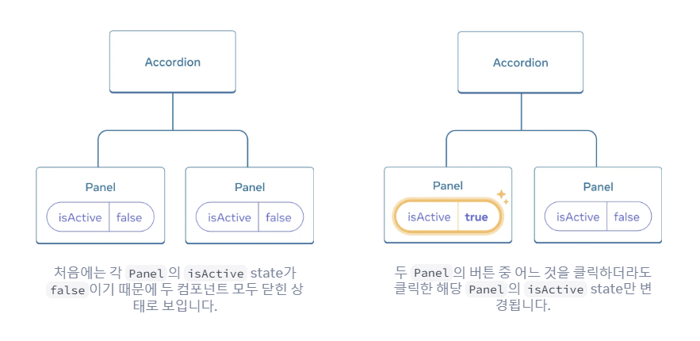
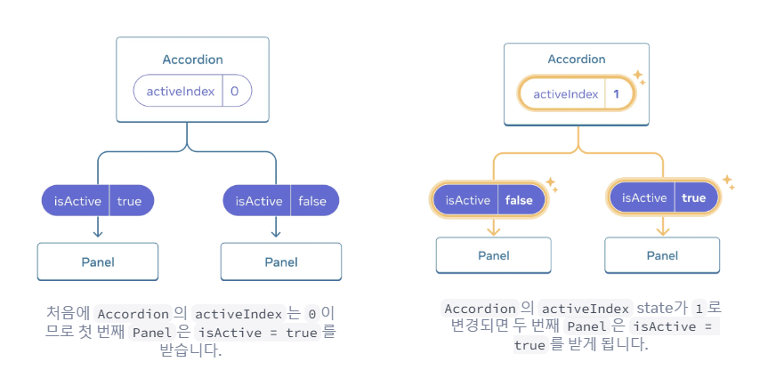
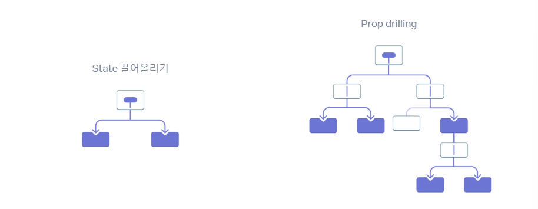
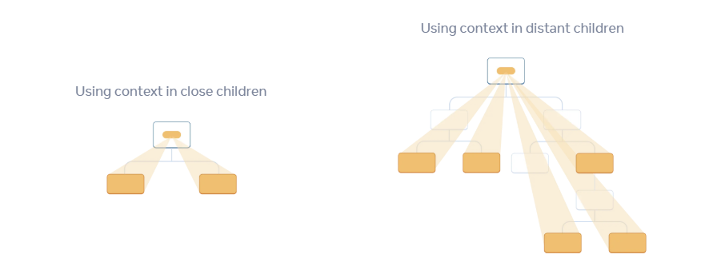

# State 관리하기

영령형 프로그래밍으로 작성한 시스템의 경우 복잡해질수록 UI 조작이 기하급수적으로 어려워진다. 이 문제를 react가 해결해줌!
React는 선언형 프로그래밍 방식을 사용하여 직접 UI를 조작할 필요없이 **무엇을 보여주고 싶은지 선언**하면 된다. (조작은 react가 해줌)

많은 시각적 state를 한 번에 보여주는 페이지를 "living styleguides" 또는 "storybooks"라고 부른다.

1. 컴포넌트의 다양한 시각적 state 확인하기
2. 무엇이 state 변화를 트리거하는지 알아내기(human input, computer input..) \*휴먼 인풋은 종종 이벤트 핸들러가 필요할 수 있다!
3. 메모리의 state를 `useState`로 표현하기
4. 불필요한 state 변수를 제거하기
5. state 설정을 위해 이벤트 핸들러를 연결하기

### state 구조화

state를 잘 구조화하면 수정과 디버깅이 즐거운 컴포넌트와 지속적인 버그의 원인이 되는 컴포넌트의 차이를 만들 수 있다.

state 구조화 원칙

1. 연관된 state 그룹화하기

- 두 개의 state 변수가 항상 함께 변경된다면 단일 state 변수로 통합하는 게 좋다.

2. state의 모순 피하기

- isSending, isSent는 동시에 true가 되면 모순된다. -> typing, sending, sent 세 가지 유효한 상태 중 하나를 가질 수 있는 status state 변수로 대체하는 것이 좋음.

3. 불필요한 state 피하기

- 렌더링 중에 컴포넌트의 props나 기존 state 변수에서 일부 정보를 계산할 수 있다면 컴포넌트의 state에 해당 정보를 넣지 않아야 한다.
  > ex) 성과 이름을 받는 폼에서 전체 이름은 둘을 조합해서 알아낼 수 있으니 성과 이름의 state만 있으면 된다!

4. state의 중복 피하기
5. 깊게 중첩된 state 피하기

- state를 평탄하게 만들면 state를 업데이트하기 쉽게 만들고 중첩된 객체의 다른 부분에 중복이 없도록 도와준다.
  > ex) 여행지 배열의 id 예시

```
export const initialTravelPlan = {
  id: 0,
  title: '(Root)',
  childPlaces: [{
    id: 1,
    title: 'Earth',
    childPlaces: [{
      id: 2,
      title: 'Africa',
      childPlaces: [{
        id: 3,
        title: 'Botswana',
        childPlaces: []
      }, {
        id: 4,
        title: 'Egypt',
        childPlaces: []
      }, {
        id: 5,
        title: 'Kenya',
        childPlaces: []
      }, {
        id: 6,
        title: 'Madagascar',
        childPlaces: []
      }, {
        id: 7,
        title: 'Morocco',
        childPlaces: []
      }, {
        id: 8,
        title: 'Nigeria',
        childPlaces: []
      }, {
        id: 9,
        title: 'South Africa',
        childPlaces: []
      }]
    },

```

이걸 밑에처럼 할 수 있다 (너무 많아서 중간에 자름)

```
export const initialTravelPlan = {
  0: {
    id: 0,
    title: '(Root)',
    childIds: [1, 42, 46],
  },
  1: {
    id: 1,
    title: 'Earth',
    childIds: [2, 10, 19, 26, 34]
  },
  2: {
    id: 2,
    title: 'Africa',
    childIds: [3, 4, 5, 6 , 7, 8, 9]
  },
  3: {
    id: 3,
    title: 'Botswana',
    childIds: []
  },
  4: {
    id: 4,
    title: 'Egypt',
    childIds: []
  },
  5: {
    id: 5,
    title: 'Kenya',
    childIds: []
  },
  6: {
    id: 6,
    title: 'Madagascar',
    childIds: []
  },
```

=> 원칙의 목표는 **오류 없이 상태를 쉽게 업데이트하는 것**이다.

### state 공유

state 끌어올리기: 두 컴포넌트의 state가 함께 변경되기를 원할 때 각 컴포넌트에서 state를 제거하고 가장 가까운 공통 부모 컴포넌트로 옮긴 후 props로 전달하는 것



- 원래 버튼 누르면 독립적으로 동작하여 한번에 모두 패널이 열렸음. -> 한번에 하나의 패널만 열리도록 변경하려면?

1. 자식 컴포넌트의 state를 제거한다.
2. 하드 코딩된 값을 공통 부모로부터 전달한다.
3. 공통 부모에 state를 추가하고 이벤트 핸들러와 함께 전달한다.


이렇게 변경된다

- 컴포넌트를 props로부터 제어할지, state로부터 비제어할지 고려하면 유용하다.
  > 컴포넌트가 제어된다: 컴포넌트의 중요한 정보가 자체 지역 state 대신 props에 의해 만들어지는 경우

### reducer

한 컴포넌트에서 state 업데이트가 여러 이벤트 핸들러로 분산되는 경우가 있는데, 이 경우 컴포넌트 관리가 어려워진다. -> state를 업데이트하는 모든 로직을 reducer를 사용해 컴포넌트 외부의 단일 함수로 통합해 관리할 수 있다.

`useState` -> `useReducer`

1. 이벤트 핸들러에서 acrion을 전달
2. 주어진 state와 action에 대해 다음 state를 반환하는 reducer 함수 작성
3. `useState`를 `useReducer`로 바꾸기

reducer를 사용하면 코드를 조금 더 작성해야 하지만 디버깅과 테스트에 도움된다.

reducer 잘 작성하는 팁

- Reducer는 반드시 순수해야 한다. (= 입력 값이 같다면 결과 값도 항상 같아야 한다)
  > reducer는 렌더링 중에 실행되기 때문(action은 다음 렌더링까지 대기함)
- 각 action은 데이터 안에서 여러 변경들이 있더라도 하나의 사용자 상호작용을 설명해야 한다.

> 배열에서 사용하는 `reduce()` 연산의 이름에서 따온 이름 `reduce()`는 배열의 여러 값을 단일 값으로 누적하는 연산을 수행한다.

### prop drilling

props 전달하기의 문제점: 어떤 prop을 트리를 통해 깊이 전해줘야 하거나 많은 컴포넌트에서 같은 prop이 필요한 경우 장황하고 불편할 수 있다. -> prop drilling이라는 상황을 초래할 수 있음


props를 계속 전달 전달하는 것보다, 순간이동(?)시킬 방법이 있다면 좋을 것 같다.. => React의 context를 사용하면 된다!!

- Context는 부모 컴포넌트가 그 아래의 트리 전체에 데이터를 전달할 수 있도록 해준다. (멀리 떨어진 컴포넌트에조차...!)
  

1. context를 생성한다 (ex. `LevelContext`라고 이름 짓기)

```
import { createContext } from 'react';

export const LevelContext = createContext(1);
```

\*여기서는 1을 전달하고 있지만 모든 종류의 값, 객체까지 전달할 수 있다. 2. 데이터가 필요한 컴포넌트에서 context를 사용한다
Heading을 감싸는 Section 태그에 level을 1~3으로 전달

Section.js는 다음과 같음

```
export default function Section({ children }) {
  return (
    <section className="section">
      {children}
    </section>
  );
}

```

3. 데이터를 지정하는 컴포넌트에서 context를 제공한다
   context provider로 감싸준다.

```
import { LevelContext } from './LevelContext.js';

export default function Section({ level, children }) {
  return (
    <section className="section">
      <LevelContext.Provider value={level}>
        {children}
      </LevelContext.Provider>
    </section>
  );
}

```

문서에 있는 예시말고 현재 색상 테마, 현재 로그인된 사용자 등 유용하고 필요한 정보를 전체 하위 트리에 전달할 수 있음!

> ex. 테마 지정하기, 현재 계정, 라우팅, 상태관리..

**무작정 Context를 남발하기도 좋지 않다!!**
