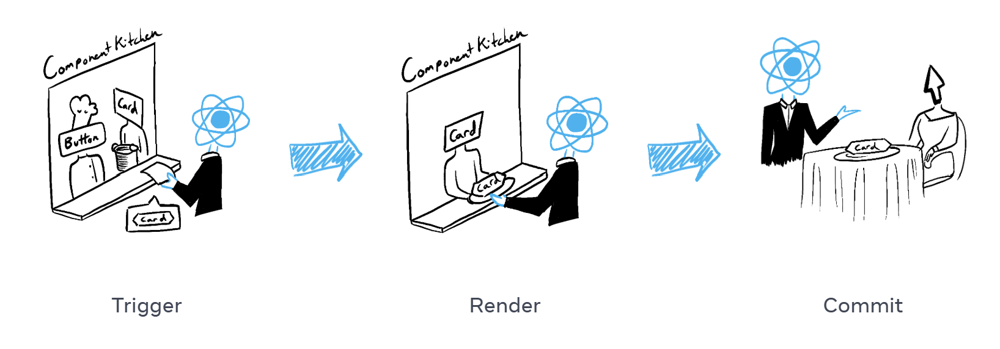
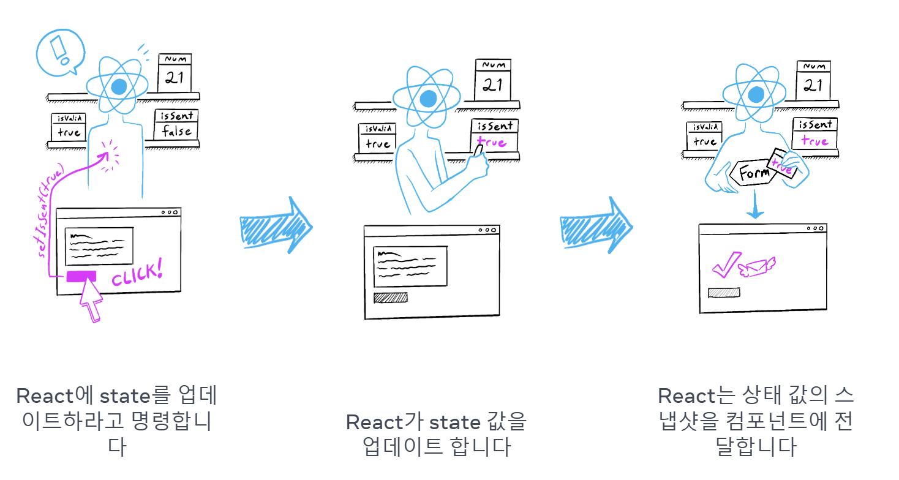

# 이벤트에 응답하기

## 이벤트 핸들러

>클릭, 마우스 hover, 폼이나 input의 focus 등 사용자 상호작용에 따라 유발되는 사용자 정의 함수

**특징**

- 주로 컴포넌트 내부에서 정의됨
- `handle`로 시작하고 그 뒤에 이벤트 명을 붙인 함수명을 가짐
<br>

### 추가하기

1. 이벤트 핸들러 함수 정의하기
2. 적절한 JSX 태그에 `prop` 형태로 전달하기

```jsx
export default function Button() {
  function handleClick() { // 이벤트 핸들러 
    console.log("클릭됨");
  }

  return (
    <button onClick={handleClick}>
      클릭 버튼
    </button>
  );
}
```

<br>

### ⚠️ 주의할 점

이벤트 핸들러는 호출이 아닌 **‘전달’** 되어야 한다. 
<br>

**함수 전달하기(O)** 

`<button onClick={handleClick}>`

<aside>
📌 `handleClick` 함수가 onClick 이벤트 핸들러에 전달됨

→ React가 이 내용을 기억하고 버튼을 클릭했을 때만 함수 호출

</aside>

<br>

**함수 호출하기(X)** 

`<button onClick={handleClick()}>`

<aside>
📌
`handleClick` 함수 끝 `()` 가 렌더링 과정 중 클릭이 없어도 즉시 함수를 실행하도록 함.

</aside>

<br>

✅ **인라인 방식도 동일**

**함수 전달하기(O)** 

`<button onClick={() => alert('...')}>`

이벤트 핸들러를 인라인으로 정의하고 싶으면, 익명 함수로 감싸야 한다. 

⇒ 매 렌더링 마다 내부 코드를 실행하지 않고 함수를 생성해 **추후 이벤트에 의해** 호출됨

<br>

**함수 호출하기(X)** 

`<button onClick={alert('...')}>`

인라인 함수를 위처럼 전달하면 컴포넌트가 렌더링될 때마다 실행 (버튼 클릭 시마다 X)

<br>

## **이벤트 핸들러 내에서 Prop 읽기**

이벤트 핸들러는 컴포넌트 내부에서 선언되기에 이들은 해당 컴포넌트의 prop에 접근 가능

- 두 개의 버튼이 서로 다른 메시지 표시

```jsx
function AlertButton({ message, children }) {
  return (
    <button onClick={() => alert(message)}>
      {children}
    </button>
  );
}

export default function Toolbar() {
  return (
    <div>
      <AlertButton message="Playing!">
        Play Movie
      </AlertButton>
      <AlertButton message="Uploading!">
        Upload Image
      </AlertButton>
    </div>
  );
}

```

<br>

## **이벤트 핸들러를 Prop으로 전달하기**

부모 컴포넌트로 자식의 이벤트 핸들러를 지정할 수 있음

```jsx
function Button({ onClick, children }) {
  return (
    <button onClick={onClick}>
      {children}
    </button>
  );
}

function PlayButton({ movieName }) {
  function handlePlayClick() {
    alert(`Playing ${movieName}!`);
  }

  return (
    <Button onClick={handlePlayClick}>
      Play "{movieName}"
    </Button>
  );

export default function Toolbar() {
  return (
    <div>
      <PlayButton movieName="Kiki's Delivery Service" />
      <UploadButton />
    </div>
  );
}
```

- `PlayButton`은 `handlePlayClick`을 Button 내 `onClick` prop으로 전달
- `UploadButton`은 `() => alert('Uploading!')`을 Button 내 `onClick` prop으로 전달
- `Button` 컴포넌트는 `onClick` prop을 받아 `<button>`의 `onClick={onClick}`으로 직접 전달

<br>

### **이벤트 핸들러 Prop 명명하기**

사용자 정의 컴포넌트에서는 이벤트 핸들러 prop의 이름을 원하는 대로 명명하기 위해 `on`으로 시작해 대문자 영문으로 잇는다.

ex) `onSmash`

<br>

## **이벤트 전파**

이벤트 핸들러는 해당 컴포넌트가 가진 어떤 자식 컴포넌트의 이벤트를 수신할 수 있는데, 이를 이벤트가 트리에 따라 “bubble”되거나 “전파된다”고 표현

```jsx
export default function Toolbar() {
  return (
    <div className="Toolbar" onClick={() => {
      alert('You clicked on the toolbar!');
    }}>
      <button onClick={() => alert('Playing!')}>
        Play Movie
      </button>
      <button onClick={() => alert('Uploading!')}>
        Upload Image
      </button>
    </div>
  );
}
```

둘 중 어느 버튼을 클릭하더라도 해당 버튼의 onClick 실행 후 부모인 <div>의 onClick이 이어서 실행됨 

⇒ 부여된 JSX 태그 내에서만 실행되는 `onScroll`을 제외한 React 내의 모든 이벤트는 전파
  
  <br>

### **전파를 멈추는 방법**

이벤트 핸들러는 **이벤트 오브젝트(e)**를 유일한 매개변수로 받는데, 이를 통해 이벤트의 정보를 읽어들일 수 있음

이벤트가 부모 컴포넌트에 닿지 못하도록 **`e.stopPropagation()`** 을 호출

( = 이벤트 핸들러가 상위 태그에서 실행되지 않도록 멈춤)

```jsx
function Button({ onClick, children }) {
  return (
    <button onClick={e => {
      e.stopPropagation();
      onClick();
    }}>
      {children}
    </button>
  );
}
```

1. 버튼 클릭 시 React가 `<button>`에 전달된 `onClick` 핸들러를 호출
2. `Button`에 정의된 해당 핸들러는 
    - `e.stopPropagation()`을 호출하여 이벤트가 더 이상 bubbling 되지 않도록 방지
    - `Toolbar` 컴포넌트가 전달해 준 `onClick` 함수를 호출
3. `Toolbar` 컴포넌트에서 정의된 위 함수가 버튼의 alert를 표시
4. 전파가 중단되었으므로 부모인 `<div>`의 `onClick`은 실행되지 않음
  
  <br>

## **기본 동작 방지하기**

일부 브라우저 이벤트는 그와 관련된 기본 브라우저 동작을 가짐

ex) `<form>`의 제출 이벤트는 그 내부의 버튼을 클릭 시 페이지 전체를 리로드

⇒ **`e.preventDefault()`** 를 이벤트 오브젝트에서 호출해 기본 동작을 방지할 수 있음

```jsx
export default function Signup() {
  return (
    <form onSubmit={e => {
      e.preventDefault();
      alert('Submitting!');
    }}>
      <input />
      <button>Send</button>
    </form>
  );
}
```

<br>

  
# **State: 컴포넌트의 기억 저장소**

컴포넌트는 상호 작용의 결과로 화면의 내용을 변경해야 하는 경우가 많은데 컴포넌트가 이를 기억해야 함 (현재 입력값, 현재 이미지, 장바구니 등)

→ 이런 종류의 컴포넌트별 메모리를 `state`라고 부름 
  
  <br>

**특징 - 격리와 비공개**

- State는 화면에서 컴포넌트 인스턴스에 지역적
    
    즉 동일한 컴포넌트를 두 번 렌더링하면 각 복사본은 다른 state를 가짐 (독립적)
    
- props와 달리 state는 선언한 컴포넌트에 비공개적
    
    → 부모 컴포넌트는 변경할 수 없음
    

지역 변수는 렌더링 간에 유지되지 않기 때문에 컴포넌트를 새로운 데이터로 업데이트 하기 위해선 `1. 렌더링 사이 데이터 유지`  `2. React가 새로운 데이터로 컴포넌트를 렌더링하도록 유발`해야 함.
  
  <br>

### ⇒ useState 훅

- ❓ **Hook**
    
    : React에서 `useState`와 같이 “`use`”로 시작하는 다른 모든 함수
    오직 렌더링 중일 때만 사용할 수 있는 함수 
    
    다양한 React 기능을 연결하는 역할 
 
  <br>

**개념** 

- `useState`를 호출하는 것은, React에 이 컴포넌트가 무언가를 기억하기를 원한다고 말하는 것
- 여러 state 변수를 지정할 수 있음 → 순서대로 매칭됨
  
  <br>

**인수** 

state 변수의 초깃값 
  
  <br>

**반환**

1. 저장한 값을 가진 **state 변수**
2. state 변수를 업데이트하고 React에 컴포넌트를 다시 렌더링하도록 유발하는 **state setter 함수**
  
  <br>

**작동 방식**

```jsx
const [index, setIndex] = useState(0);
```

1. **컴포넌트가 처음 렌더링 됨**
    
    index의 초깃값으로 useState를 사용해 0을 전달했으므로 [0, setIndex]를 반환합니다. React는 0을 최신 state 값으로 기억
    
2. **state를 업데이트**
    
    사용자가 버튼을 클릭하면 `setIndex(index + 1)`를 호출합니다.  이는 React에 index는 1임을 기억하게 하고 또 다른 렌더링을 유발
    
3. **컴포넌트가 두 번째로 렌더링 됨**
    
    React는 여전히 `useState(0)`를 보지만, `index`를 `1`로 설정한 것을 기억하고 있기 때문에, 이번에는 `[1, setIndex]`를 반환
    
4. 반복 
  
  <br>

**사용하기**

```jsx
// 1. import
import { useState } from 'react';  

// 2. 선언
const [index, setIndex] = useState(0); // [sate 변수, setter 함수]

// 3. 상태 업데이트 
function handleClick() {
  setIndex(index + 1);
}
```

💡`[`와 `]` 문법을 배열 구조 분해라고 하며, 배열로부터 값을 읽을 수 있게 함
  
  <br>

# 렌더링 그리고 커밋

컴포넌트를 화면에 표시하기 이전에 React에서 렌더링해야 함



1. 렌더링 **트리거** (손님의 주문을 주방으로 전달)
2. 컴포넌트 **렌더링** (주방에서 주문 준비하기)
3. DOM에 **커밋** (테이블에 주문한 요리 내놓기)
  
  <br>

## 렌더링 **트리거**

컴포넌트 렌더링이 일어나는 이유
  


1. **컴포넌트 초기 렌더링**
    
    앱을 시작할 때 초기 렌더링을 트리거 해야 함. 
    
    ```jsx
    import Image from './Image.js';
    import { createRoot } from 'react-dom/client';
    
    const root = createRoot(document.getElementById('root'))
    root.render(<Image />);
    ```
    
    대상 DOM 노드와 함께 [`createRoot`](https://ko-react-exy5xcwjj-fbopensource.vercel.app/reference/react-dom/client/createRoot)를 호출한 다음 해당 컴포넌트로 `render` 메서드를 호출해서 진행  
  
  <br>
    
2. **컴포넌트 state 업데이트**
    
    컴포넌트가 처음으로 렌더링 된 후에는 `set` 함수를 통해 상태를 업데이트하여 추가적인 렌더링을 트리거할 수 있음
    
    - 컴포넌트 업데이트시 자동으로 렌더링 대기열에 추가됨
  
  <br>

## **React 컴포넌트 렌더링**

>**렌더링**: React에서 컴포넌트를 호출하는 것

렌더링을 트리거한 후 React는 컴포넌트를 호출하여 화면에 표시할 내용을 파악함

- **초기 렌더링에서** React는 루트 컴포넌트를 호출
- **이후 렌더링에서** React는 state 업데이트가 일어나 렌더링을 트리거한 컴포넌트를 호출
  
  <br>

**재귀적 단계**

업데이트된 컴포넌트가 다른 컴포넌트를 반환 → React는 다음으로 해당 컴포넌트를 렌더링 → 해당 컴포넌트도 반환 → 반환된 컴포넌트를 다음에 렌더링하는 방식 

: 중첩된 컴포넌트가 더 이상 없고 화면에 표시되어야 하는 내용을 정확히 알 때까지 반복
  
  <br>

## **React가 DOM에 변경사항을 커밋**

컴포넌트를 렌더링(호출)한 후 React는 DOM을 수정

- **초기 렌더링의 경우** React는 [`appendChild()`](https://developer.mozilla.org/docs/Web/API/Node/appendChild) DOM API를 사용하여 생성한 모든 DOM 노드를 화면에 표시
- **리렌더링의 경우** React는 필요한 최소한의 작업(렌더링하는 동안 계산된 것)을 적용하여 DOM이 최신 렌더링 출력과 일치하도록 함

⇒ **React는 렌더링 간에 차이가 있는 경우에만 DOM 노드를 변경**
  
  <br>

**✅ 순수성** 

렌더링 결과가 이전과 같으면 React는 DOM을 건드리지 않는다.
  
  <br>

# 스냅샷으로서의 State

State 변수는 읽고 쓸 수 있는 일반 자바스크립트 변수처럼 보일 수 있지만 state는 스냅샷처럼 동작함

→ **state 변수를 설정**해도 이미 가지고 있는 state 변수는 변경되지 않고, **리렌더링 발동** 
  
  <br>

## **state를 설정하면 렌더링이 동작**

state 설정시 Reaxt에 리렌더링 요청

= 인터페이스가 이벤트에 반응하려면 state 업데이트 필요
  
  <br>

## **렌더링은 그 시점의 스냅샷을 찍는다**

React에서 **렌더링**은 **컴포넌트 함수가 호출**되고, 이 함수가 반환하는 JSX가 UI의 "스냅샷”이 되는 과정을 의미

- `useState`를 호출하면 React는 해당 렌더링에 대한 state의 스냅샷을 제공
  
  <br>

이 스냅샷은 현재 UI의 상태를 나타내며, **props**, **이벤트 핸들러**, **로컬 변수** 등을 사용하여 계산됨

- **UI의 스냅샷**은 **대화형**
    - 버튼 클릭과 같은 **이벤트 핸들러**가 포함
- React는 이 **스냅샷을 기반으로 화면을 업데이트**하고, 이벤트 핸들러를 연결
  
  <br>

### React가 리렌더링할 때

1. React가 함수를 재호출
2. 함수가 새로운 JSX 스냅샷을 반환.
3. 그러면 React가 함수가 반환한 스냅샷과 일치하도록 화면을 업데이트


  
  <br>

**state를 설정하면 다음 렌더링에 대해서만 변경됨**

아래 예시에서  ****`setNumber(number + 1);` 는 (0+1)이고, 리액트는 1로 변경할 준비만 함

```jsx
// 결과: 1 
<button onClick={() => {
  setNumber(number + 1);
  setNumber(number + 1);
  setNumber(number + 1);
}}>+3</button>
```
  
  <br>

## **시간 경과에 따른 State**

> **state 변수의 값은** 이벤트 핸들러의 코드가 비동기적이더라도 **렌더링 내에서 절대 변경되지 않는다.**
> 

```jsx
import { useState } from 'react';

export default function Counter() {
  const [number, setNumber] = useState(0);

  return (
    <>
      <h1>{number}</h1>   {/* 5 */}
      <button onClick={() => {
        setNumber(number + 5);
        setTimeout(() => {
          alert(number); {/* 0, 스냅샷 */}
        }, 3000);
      }}>+5</button>
    </>
  )
}
```

React에 저장된 state는 경고창이 실행될 때 변경되었을 수 있지만 사용자가 상호작용한 시점에 state 스냅샷을 사용하는 건 이미 예약되어 있던 것

 `setNumber(number + 5)`가 호출된 후에도 number의 값은 계속 0인 이유는 , 컴포넌트를 호출해 React가 UI의 스냅샷을 찍을 때 고정된 값이기 때문 
  
  <br>

> **React는 렌더링의 이벤트 핸들러 내에서 state 값을 “고정”으로 유지한다.**
> 

코드가 실행되는 동안 state가 변경되었는지를 걱정할 필요가 없다. → alert창에 Alice 이름이 출력되는 이유

- 과거에 생성된 이벤트 핸들러는 그것이 생성된 렌더링 시점의 state 값을 가짐

```jsx
import { useState } from 'react';

export default function Form() {
  const [to, setTo] = useState('Alice');
  const [message, setMessage] = useState('Hello');

  function handleSubmit(e) {
    e.preventDefault();
    setTimeout(() => {
      alert(`You said ${message} to ${to}`);
    }, 5000);  // Alixe 표기 
  }

  return (
    <form onSubmit={handleSubmit}>
      <label>
        To:{' '}
        <select
          value={to}
          onChange={e => setTo(e.target.value)}>
          <option value="Alice">Alice</option>
          <option value="Bob">Bob</option>
        </select>
      </label>
      <textarea
        placeholder="Message"
        value={message}
        onChange={e => setMessage(e.target.value)}
      />
      <button type="submit">Send</button>
    </form>
  );
}

```