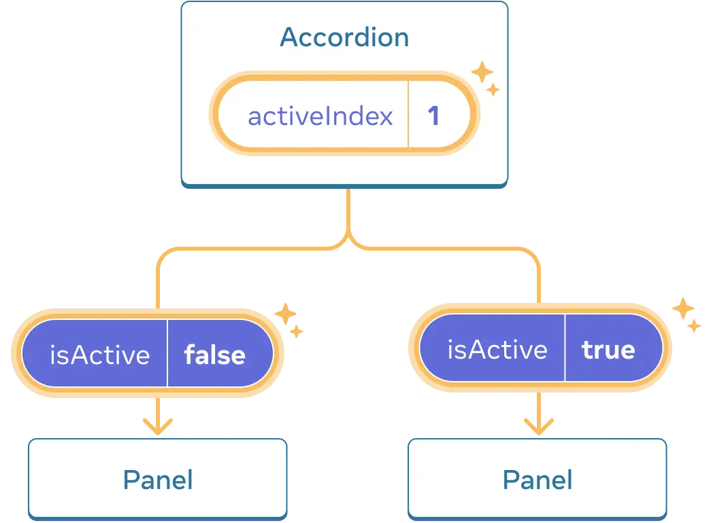

# **State를 사용해 Input 다루기**

## **UI를 선언적인 방식으로 생각하기**

1. 컴포넌트의 다양한 시각적 state를 확인
2. 무엇이 state 변화를 트리거하는지 알아내기
    - 휴먼 인풋: 버튼 누르기, 필드 입력, 링크 이동 등
    - 컴퓨터 인풋: 네트워크 응답, 타임아웃, 이미지 로딩 등
3. `useState`를 사용해서 메모리의 state를 표현
4. 불필요한 state 변수를 제거
    - 리팩토링하기: state가 사용자에게 유효한 UI를 보여주지 않는 경우 방지
    - 꼭 필요한 state만 남기기
5. state 설정을 위해 이벤트핸들러를 연결

# **State 구조 선택하기**

## State 구조화 원칙

### 연관된 state 그룹화하기

- 2개 이상의 state 변수를 항상 동시에 업데이트한다면 병합 고려

```tsx
// 이렇게 말고
const [x, setX] = useState(0);
const [y, setY] = useState(0);
```

```tsx
// 이렇게 병합
const [position, setPosition] = useState({ x: 0, y: 0 });
```

⚠️ State 변수가 객체일 때 다른 필드를 명시적으로 복사하지 않고 하나의 필드만 업데이트 불가 (`setPosition({ ...position, x: 100 }`)

### state의 모순 피하기

```tsx
setIsSending(true);
setIsSent(true);
```

isSending과 isSent 두 가지 상태가 전송 중인지 전송 완료인지 관리하는데, 이 두 개의 상태가 동시에 true가 되면 안됨.

```tsx
const [status, setStatus] = useState('typing');

const isSending = status === 'sending';
const isSent = status === 'sent';

if (isSent) {
  return <h1>Thanks for feedback!</h1>
}
```

⇒ typing, sending, sent 이런 상태를 `하나의 status`라는 상태로 관리

### 불필요한 state 피하기

- 렌더링 중에 컴포넌트의 props나 기존 state 변수에서 일부 정보를 계산할 수 있다면, 컴포넌트의 state에 해당 정보를 넣지 않아야 함

```jsx
const [firstName, setFirstName] = useState('');
const [lastName, setLastName] = useState('');

const fullName = firstName + ' ' + lastName; // 렌더링 중 계산
```

### state의 중복 피하기

동일한 데이터를 여러 곳에 저장하면 동기화 오류가 생기기 쉽다.

`selectedItem` 객체(`items` 내부의 객체와 중복을 생성하는) 대신 `selectedId`를 state로 유지하고, *그다음* `items` 배열에서 해당 ID의 항목을 검색하여 `selectedItem`을 가져온다.

```jsx
  const [items, setItems] = useState(initialItems);
  const [selectedId, setSelectedId] = useState(0);

  const selectedItem = items.find(item =>
    item.id === selectedId
  );
```

### 깊게 중첩된 state 피하기

깊게 계층화된 state는 업데이트하기 쉽지 않음 (중첩된 state를 업데이트하는 것은 변경된 부분부터 모든 객체의 복사본을 만드는 것 )

트리 구조 대신 id 배열을 사용하는 등 평탄화(정규화)하기 

```jsx
// 각 장소가 자식 장소의 id를 가질 수 있도록

export const initialTravelPlan = {
  0: {
    id: 0, 
    title: '(Root)',
    childIds: [1, 42, 46],
  },
  1: {
    id: 1,
    title: 'Earth',
    childIds: [2, 10, 19, 26, 34]
  },
  2: {
    id: 2,
    title: 'Africa',
    childIds: [3, 4, 5, 6 , 7, 8, 9]
  },
  ...
```

# 컴포넌트 간 State 공유하기

## State 끌어올리기

두 컴포넌트의 state가 함께 변경되기를 원할 때, 각 컴포넌트에서 state를 제거하고 가장 가까운 공통 부모 컴포넌트로 옮긴 후 props 전달 

### 1. 자식 컴포넌트에서 state 제거하기

```jsx
// Panel 컴포넌트에서 제거
const [isActive, setIsActive] = useState(false); 

// 대신 Panel의 prop 목록에 isActive를 추가
function Panel({ title, children, isActive }) {
```

이제 Panel의 부모 컴포넌트는 props 내리꽂기를 통해 isActive를 제어할 수 있음. 반대로 Panel 컴포넌트는 isActive를 제어할 수 없다.

### 2. **하드 코딩된 데이터를 부모 컴포넌트로 전달하기**

state를 올리기 위해 조정하려는 자식 컴포넌트의 가장 가까운 공통 부모 컴포넌트에 두어야 한다. 

```jsx
import { useState } from 'react';

// 두 Panel의 상위에 있고 props 제어 가능 -> 현재 어느 패널이 활성화되었는지 확인
export default function Accordion() {
  return (
    <>
      <h2>Almaty, Kazakhstan</h2>
      <Panel title="About" isActive={true}>
        With a population of about 2 million, Almaty is Kazakhstan's largest city. From 1929 to 1997, it was its capital city.
      </Panel>
      <Panel title="Etymology" isActive={true}>
        The name comes from <span lang="kk-KZ">алма</span>, the Kazakh word for "apple" and is often translated as "full of apples". In fact, the region surrounding Almaty is thought to be the ancestral home of the apple, and the wild <i lang="la">Malus sieversii</i> is considered a likely candidate for the ancestor of the modern domestic apple.
      </Panel>
    </>
  );
}

```

### 3. 공통 부모에 state 추가하기

부모에 state를 정의함으로써 자식은 그 값을 직접 변경할 수 없다.

```jsx
// 한 번에 하나의 패널만 활성화하기 위해 
// 활성화되어있는 panel의 인덱스 숫자 활용 
const [activeIndex, setActiveIndex] = useState(0);

// Accordion 컴포넌트는 Panel 컴포넌트가 state를 변경할 수 있음을 
// 이벤트 핸들러를 prop으로 전달하기를 통해 명시적으로 허용
<>
  <Panel
    isActive={activeIndex === 0}
    onShow={() => setActiveIndex(0)}
  >
    ...
  </Panel>
  <Panel
    isActive={activeIndex === 1}
    onShow={() => setActiveIndex(1)}
  >
    ...
  </Panel>
</>
```



### 각 state의 단일 진리의 원천

각각의 고유한 state에 대해 어떤 컴포넌트가 “소유”할지 고를 수 있는 것

→ 모든 state가 한 곳에 존재한다는 의미가 아니라 그 정보를 가지고 있는 특정 컴포넌트가 있다는 것. 컴포넌트 간의 공유된 state를 중복하는 대신 그들의 공통 부모로 끌어올리고 필요한 자식에게 전달할 수 있음

# **State를 보존하고 초기화하기**

각 컴포넌트는 독립된 state를 가진다. React는 UI 트리에서의 위치를 통해 state가 어떤 컴포넌트에 속하는지 추적하고 리렌더링마다 언제 state를 보존하고 초기화할지 컨트롤 가능하다.

## State는 렌더트리의 위치에 연결

React는 UI 안에 있는 컴포넌트 구조로 렌더 트리를 만든다.

컴포넌트가 UI 트리에 있는 위치를 이용해 React가 가지고 있는 각 state를 알맞은 컴포넌트와 연결되니 동일한 컴포넌트여도 위치가 다르면 state도 완전히 분리된다. 

컴포넌트가 트리에서 제거되면 해당 state도 함께 삭제되고, 다시 추가하면 state는 초기값으로 재생성된다.

즉, state는 컴포넌트의 존재 위치에 따라 생성, 유지, 삭제된다.

## 같은 자리의 같은 컴포넌트는 state 보존

컴포넌트가 UI 트리에서 같은 위치에 렌더링되면 state 유지한다.

JSX 코드에서 조건문이나 분기처리가 있어도 반환된 UI 트리 구조상 같은 위치에 같은 컴포넌트라면 동일한 컴포넌트로 인식한다. 

## **같은 위치의 다른 컴포넌트는 state를 초기화**

같은 자리의 다른 컴포넌트 타입으로 바꾸면 UI 트리에서 해당 컴포넌트와 state를 제거한다. 또한, 같은 위치에 다른 컴포넌트를 렌더링할 때 컴포넌트는 그의 전체 서브 트리의 state를 초기화한다. 

즉, 리렌더링할 때 state를 유지하고 싶다면, 트리 구조가 “같아야” 한다. 만약 구조가 다르다면 React가 트리에서 컴포넌트를 지울 때 state로 지우기 때문에 state가 유지되지 않는다.

## 같은 위치에서 state 초기화

기본적으로 React는 컴포넌트가 같은 위치를 유지하면 state를 유지하지만, state를 초기화 하고 싶다면 두 가지 방법이 있다.

### 1. 다른 위치에 컴포넌트 렌더링하기

서로 다른 위치에 컴포넌트를 분리해 렌더링하면 각각의 컴포넌트는 독립적으로 자신의 state를 가진다.

한 쪽이 DOM에서 사라지면 해당 컴포넌트의 state도 함께 삭제된다.

### 2. key를 이용해 state 초기화하기

같은 자리에 컴포넌트를 번갈아 렌더링하더라고, 각 컴포넌트에 서로 다른 key를 부여하면 React는 부모 내에서의 순서 대신 key 자체를 위치의 일부로 사용해 각각 별개의 컴포넌트로 취급해 state를 따로따로 관리한다. 

즉, key가 바뀔 때마다 state도 초기화된다. 

✅ key는 전체 앱에서 유일할 필요 없이 부모 컴포넌트의 동일한 레벨에서만 고유하면 충분

# **state 로직을 reducer로 작성하기**

한 컴포넌트에서 state 업데이트가 여러 이벤트 핸들러로 분산될 경우 관리가 어렵기 때문에 state 업데이트 로직으로 reducer를 사용해 컴포넌트 외부의 단일 함수로 통합해 관리할 수 있다.

> 📌 **reducer 함수**
: 상태와 액션을 받아 새로운 상태를 반환하는 함수

## **reducer를 사용하여 state 로직 통합하기**

> useState에서 useReducer로 바꾸는 방법
> 

### 1. action을 dispatch 함수로 전달

setState로 직접 state를 업데이트하는 대신, useReducer를 사용해 “어떤 변화가 일어났는지”를 action 갹체로 만들어 dispatch 함수에 전달

```jsx
function handleDeleteTask(taskId) {
  dispatch(
    // "action" 객체:dispatch 함수에 넣어준 객체
    {
      type: 'deleted',
      id: taskId
    }
  );
}
```

### 2. reducer 함수 작성

상태 관리 로직을 컴포넌트 외부에 선언

1) 첫 번째 인자에 현재 state (`tasks`) 선언하기

2) 두 번째 인자에 `action` 객체 선언하기

3) reducer에서 다음 state 반환하기 (React가 state에 설정하게 될 값)

```jsx
function tasksReducer(tasks, action) {
  if (action.type === 'added') {
    return [...tasks, {
      id: action.id,
      text: action.text,
      done: false
    }];
  } else if (action.type === 'changed') {
    return tasks.map(t => {
      if (t.id === action.task.id) {
        return action.task;
      } else {
        return t;
      }
    });
  } else if (action.type === 'deleted') {
    return tasks.filter(t => t.id !== action.id);
  } else {
    throw Error('Unknown action: ' + action.type);
  }
}
```

### 3. 컴포넌트에서 reducer 사용

```jsx
const [tasks, dispatch] = useReducer(tasksReducer, initialTasks);
```

useReducer 훅이 넘겨 받는 인자

1. reducer 함수
2. 초기 state 값

반환하는 것

1. state를 담을 수 있는 값
2. dispatch 함수 (사용자의 action을 reducer 함수에게 전달하게 될)

## useState vs useReducer

| 구분 | **useState** | **useReducer** |
| --- | --- | --- |
| **코드 크기** | 짧고 간단, 바로 사용 가능 | 초기 세팅 코드(리듀서, 액션 등) 많음 하지만 복잡할수록 효과적 |
| **가독성** | 간단한 상태에 최적, 한눈에 이해 쉬움 | 복잡한 상태·여러 액션에 더 명확, 업데이트 로직 분리로 구조화 |
| **디버깅** | 어디서 어떻게 바뀌는지 추적 어려울 수 있음 | 모든 상태 변경이 리듀서·액션에 모여 있어 추적·로깅 쉬움 |
| **테스팅** | 컴포넌트 내부에 묶여있어 단독 테스트 어려움 | 리듀서가 순수 함수라 단위 테스트, 재사용, 분리 쉬움 |
| **적합한 상황** | 단순한 상태/업데이트가 적을 때 | 복잡한 상태, 다양한 액션, 업데이트 규칙이 분리되어야 할 때 |
| **개인 취향** | 빠르고 직관적, 소규모 컴포넌트에 선호 | 구조화된 코드, 명확한 로직 분리 선호 시 선호 |

## 유의사항

- 순수성: reducer는 렌더링 중에 실행되무로 입력값이 같다면 결과도 항상 같아야 함, 요청을 보내거나 사이드 이펙트(컴포넌트 외부에 영향을 미치는 작업) 수행 금지
- 각 action은 단일 사용자 상호작용: 한 번의 사용자 행동을 설명하는 이름 하나로 묶어 전달

# **Context를 사용해 데이터를 깊게 전달하기**

- 기존 props 전달하기의 방법
    
    :UI 트리를 통해 해당 데이터를 사용하는 컴포넌트에 명시적으로 데이터를 전달했다. 
    
- 단점
    - 깊은 트리이거나 많은 컴포넌트에서 같은 prop이 필요한 경우 장황하고 불편
    - 데이터가 필요한 여러 컴포넌트의 가장 가까운 공통 부모가 트리의 높은 곳에 위치한 경우 state를 끌어올리면 Prop drilling 상황을 초래

## Context: Props 전달하기의 대안

Context는 중간 컴포넌트를 거치지 않고 트리 아래 어디서나 데이터를 읽고 전달할 수 있게 한다.

### 1. Context 생성

`createContext`의 유일한 인자는 기본 값

```jsx
import { createContext } from 'react';

export const LevelContext = createContext(1);
```

### 2. Context 사용하기

`useContext` 는 훅이므로, React 컴포넌트의 바로 안에서만 호출 가능 (반복문이나 조건문 내부 X) 

`useContext`는 React에게 `Heading` 컴포넌트가 `LevelContext`를 읽으려 한다고 알려준다. 

```jsx
export default function Heading({ children }) {
  const level = useContext(LevelContext);
  // ...
}
```

### 3. Context 제공하기

자식들에게 제공하기 위해 **context provider**로 감싼다.

```jsx
import { LevelContext } from './LevelContext.js';

// Section 내의 어떤 컴포넌트가 LevelContext를 요구하면 level을 주라고 알려줌
// level을 각 Heading 컴포넌트에 전달할 필요 X
export default function Section({ level, children }) {
  return (
    <section className="section">
      <LevelContext.Provider value={level}>
        {children}
      </LevelContext.Provider>
    </section>
  );
}
```

1. `level` prop 을 `<Section>`에 전달
2. `Section`은 자식을 `<LevelContext.Provider value={level}>`로 감쌈
3. `Heading`은 `useContext(LevelContext)`를 사용해 가장 근처의 `LevelContext`의 값을 요청합니다.

## Context로 중간 컴포넌트 지나치기

- Context를 제공하는 컴포넌트와 context를 사용하는 컴포넌트 사이에 원하는 만큼의 컴포넌트를 삽입할 수 있다.
- 자식 컴포넌트는 자신과 가장 가까운 Provider에서 context 값을 자동으로 받아온다.
- Context를 이용하면 컴포넌트는 자신이 트리에서 어디 렌더링됐는지, 어떤 context에 속해있는지에 따라 자동으로 값을 받아 적절히 동작할 수 있다.
- 이 작동 방식은 CSS 상속(예: color)이 중간 노드에 관계없이 하위에 전파되는 것과 유사하다.
- 서로 다른 context는 서로 영향을 주지 않는다. 각 context는 완전히 분리되어 독립적으로 동작한다.

## 주의점

- Context는 props를 여러 단계로 전달하는 게 부담스러울 때만 사용을 고려
- props 전달이나 children 패턴(컴포넌트 추출)을 먼저 시도해보고, 이로 해결되지 않을 때 context를 사용